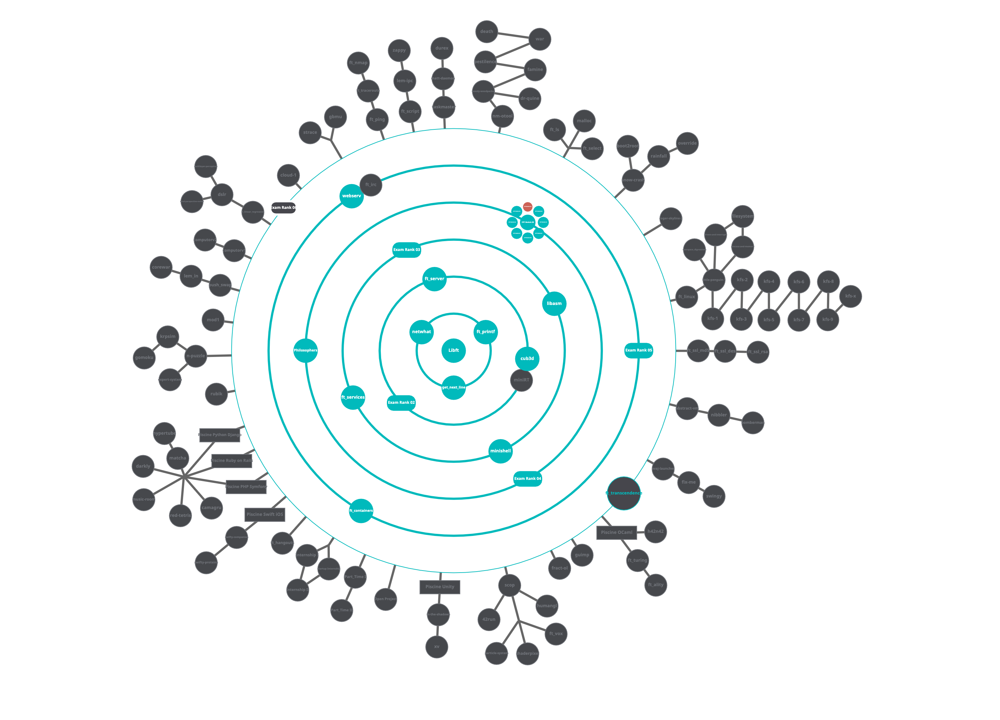
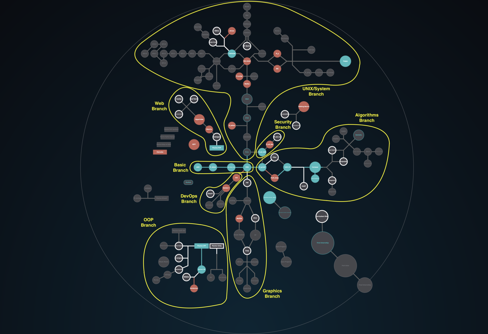
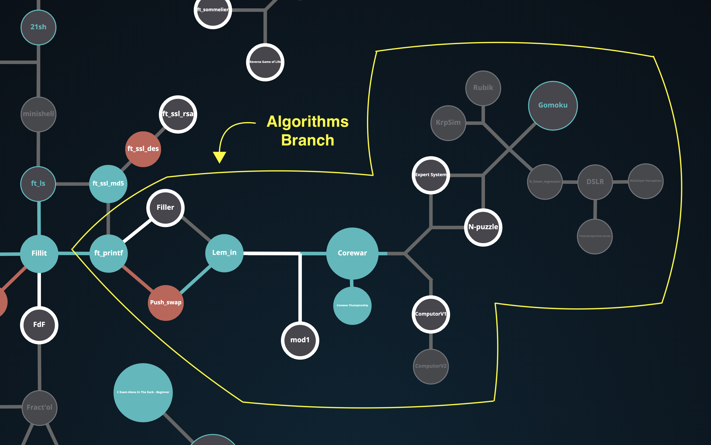
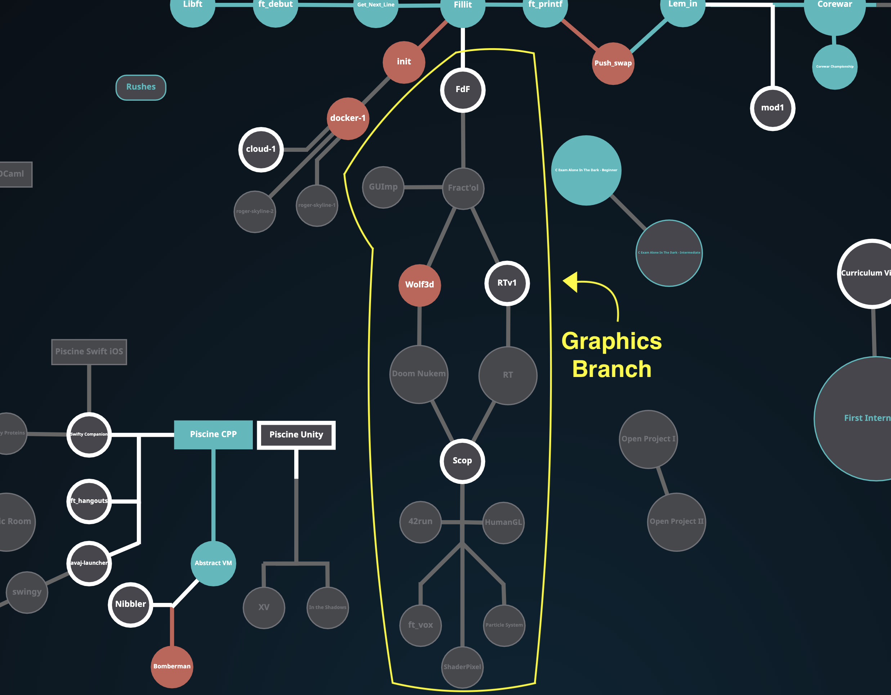
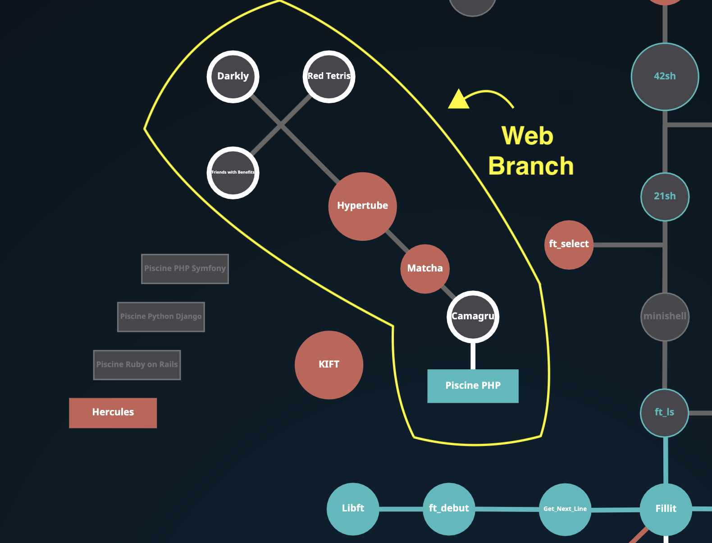
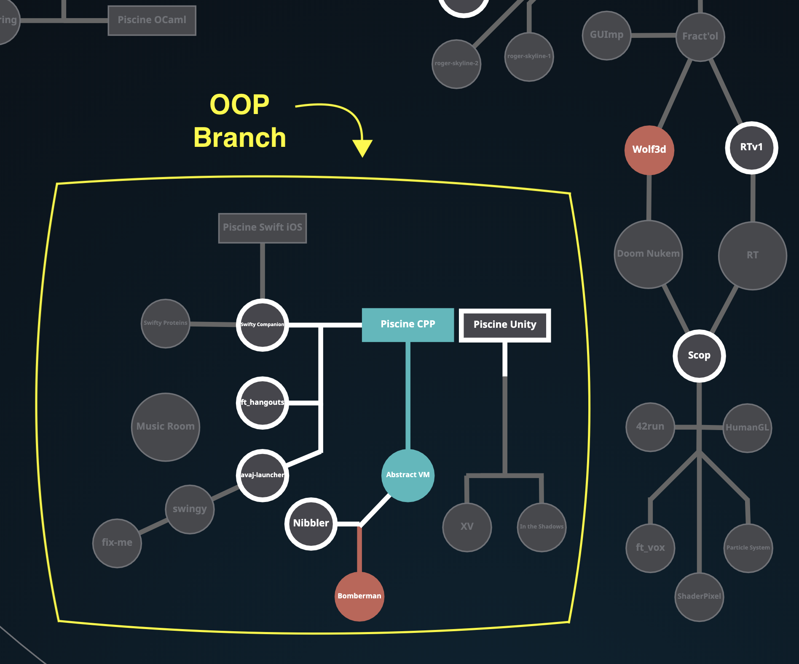
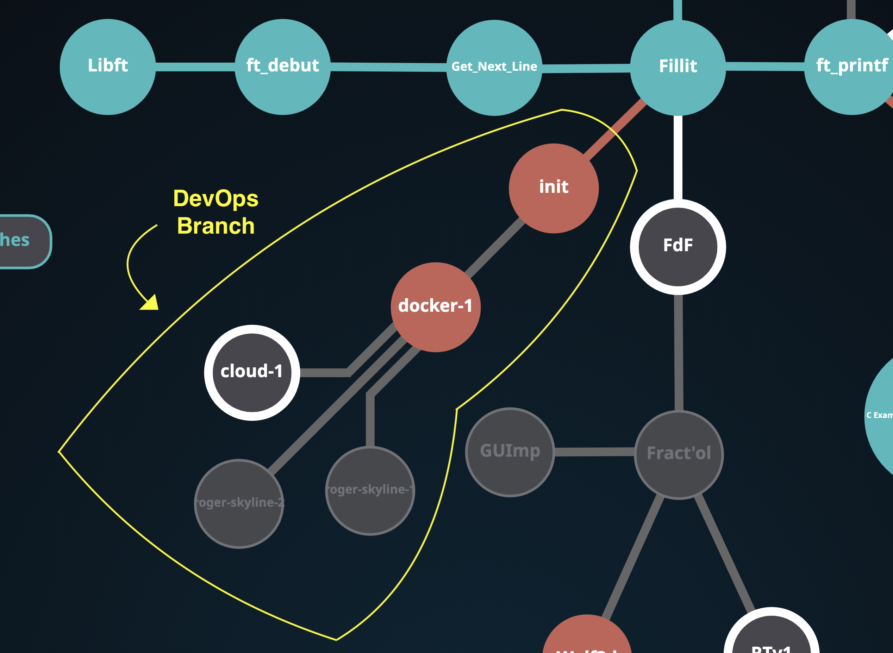
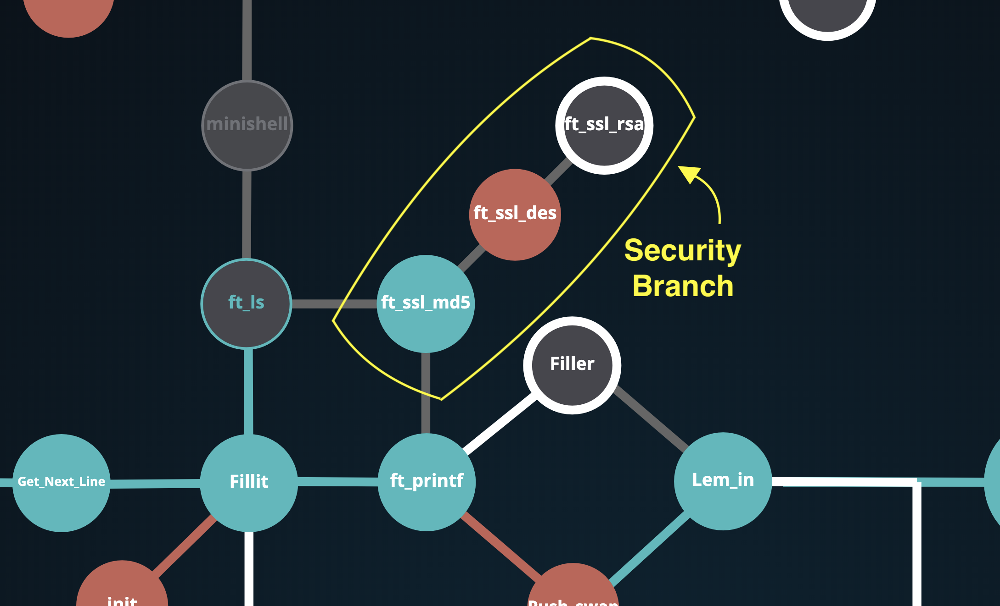

# The Answer to the Ultimate Question of Life, the Universe, and Everything is...

## Posting all 42 projects done by the "Cult of the Oogstyf"

### New Holy Graph

### The Old 42 Holy Graph (42 curriculum):

### 2. Algorithms branch

### 3. Unix branch

### 4. Graphics branch

### 5.  Web branch

### 6. OOP branch

### 7. DevOps branch

### 8. Security branch

Images credit: https://github.com/psprawka && http://github.com/Kwevan Thanks :)